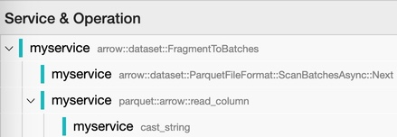
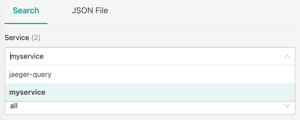
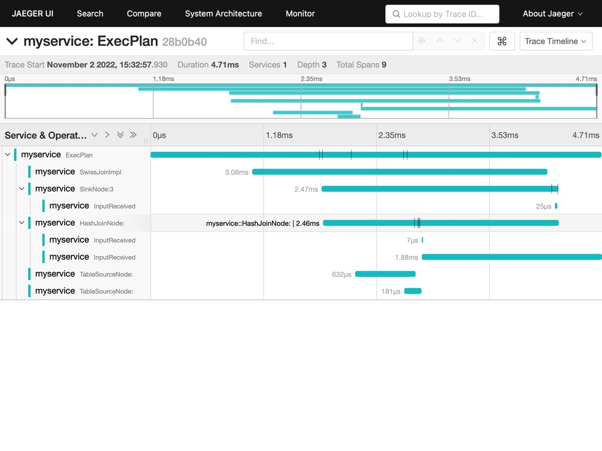

# arrow-opentelemetry-example

Worked example of how to view [OpenTelemetry](https://opentelemetry.io/) traces emitted by [Apache Arrow](https://arrow.apache.org/) using [Jaeger UI](https://www.jaegertracing.io/).



## Pre-requisites

To follow all of the steps, you will need:

- [git](https://git-scm.com)
- [conda](https://conda.io/projects/conda/en/latest/user-guide/install/index.html) or another way to set up a [libarrow development environment](https://arrow.apache.org/docs/developers/cpp/index.html)
- [Docker](https://www.docker.com/) + w/ `docker compose` or equivalent

## Steps

At a high level, we:

1. Make a custom build of libarrow with `ARROW_WITH_OPENTELEMETRY` enabled
2. Build pyarrow against that build so we can run a script of interest and produces traces
3. Start a minimal OpenTelemetry stack (i.e., Jaeger UI, an OpenTelemetry collector) to collect a view those traces
4. Run our script to produce traces
5. View the results in Jaeger UI

## Make a custom build of libarrow

Published distributions of Apache Arrow don't come with OpenTelmetry tracing enabled so we have to check out Apache Arrow from source and build it ourselves.
These steps are very similar to the [official documentation](https://arrow.apache.org/docs/developers/cpp/building.html) but all steps are reproduced here for completeness.

```sh
git clone https://github.com/apache/arrow
cd arrow
```

I use Conda here because it makes it easy spin up a complete and clean build environment:

```sh
conda create -y -n arrow-tracing \
    --channel=conda-forge \
    --file ci/conda_env_unix.txt \
    --file ci/conda_env_cpp.txt \
    --file ci/conda_env_python.txt \
    --file ci/conda_env_sphinx.txt \
    clang_osx-arm64=14 \
    clang-tools=14 \
    compilers \
    python=3.10
conda activate arrow-tracing
export ARROW_HOME=$CONDA_PREFIX
```

Once we're in our checkout of the Apache Arrow source, we need to make a fresh directory for our build.
We'll do that under the `cpp` directory at `./cpp/build`.

```sh
cd cpp
mkdir build
cd build
```

Next, run cmake with with the options required for your use case or use the following.
Note: It's critical that you set `-DARROW_WITH_OPENTELEMETRY="ON"`.

```sh
cmake -DCMAKE_INSTALL_PREFIX=$ARROW_HOME \
      -DCMAKE_INSTALL_LIBDIR=lib \
      -DARROW_BUILD_INTEGRATION="ON" \
      -DARROW_BUILD_STATIC="OFF" \
      -DARROW_BUILD_TESTS="ON" \
      -DARROW_COMPUTE="ON" \
      -DARROW_CSV="ON" \
      -DARROW_DATASET="ON" \
      -DARROW_WITH_BZ2=ON \
      -DARROW_EXTRA_ERROR_CONTEXT="ON" \
      -DARROW_FILESYSTEM="ON" \
      -DARROW_JSON="ON" \
      -DARROW_MIMALLOC="ON" \
      -DARROW_PARQUET="ON" \
      -DARROW_WITH_BROTLI="ON" \
      -DARROW_WITH_BZ2="ON" \
      -DARROW_WITH_LZ4="ON" \
      -DARROW_WITH_RE2="ON" \
      -DARROW_WITH_SNAPPY="ON" \
      -DARROW_WITH_UTF8PROC="ON" \
      -DARROW_WITH_ZLIB="ON" \
      -DARROW_WITH_ZSTD="ON" \
      -DCMAKE_BUILD_TYPE="Debug" \
      -DGTest_SOURCE=BUNDLED \
      -DARROW_WITH_OPENTELEMETRY="ON" \
  ..
```

Compile and install into our Conda environment:

```sh
make -j8
make install
```

## Build pyarrow

While we could produce traces in any environment that uses libarrow, for ease of setup, we will use [PyArrow](https://arrow.apache.org/docs/python).
The steps here are very similar to the [official documentation](https://arrow.apache.org/docs/developers/python.html) but are included here for completeness.


First, `cd` into the `python` subdirectory of your Apache Arrow checkout:

```
cd ../..
cd python
```

Set `PYARROW_PARALLEL=8` so our build uses more than one core:

```
export PYARROW_PARALLEL=8
```

To get the script we're going to run below to work, we'll need to customize our build to support the [Datsaet API](https://arrow.apache.org/docs/python/dataset.html):

```
export PYARROW_WITH_DATASET=1
```

Last, build PyArrow and install into the Conda environment:

```
python setup.py build_ext --inplace
 python -m pip install -e . --no-build-isolation
```

At this point, our Conda environment has our custom build of libarrow and a build of PyArrow that knows how to use it.

## Start a minimal OpenTelemetry stack

Start up a minimal OpenTelemetry stack with:

Back up to the root of this repository:

```sh
cd ../..
```

Then start up the OpenTelemetry stack:

```sh
docker compose up -d
```

Note: This may take some time depending on the speed of your network connection.

## Run our script

When we run our PyArrow code, libarrow will look for a few environment variables to enable tracing and configure it appropriately for our setup.

The first enables exporting OpenTelemetry traces over HTTP:

```sh
export ARROW_TRACING_BACKEND=otlp_http
```

Note: This is documented in the [Environment Variables](https://arrow.apache.org/docs/cpp/env_vars.html#envvar-ARROW_TRACING_BACKEND) documentation.

The last two (1) configure where our traces will get exported and (2) gives our script a recognizable name.

```sh
export OTEL_EXPORTER_OTLP_ENDPOINT="http://localhost:4318"
export OTEL_RESOURCE_ATTRIBUTES="service.name=myservice"
```

The script we're going to run is a simple example taken from the [PyArrow documentation](https://arrow.apache.org/docs/python/compute.html#table-and-dataset-joins).

```python
# From https://arrow.apache.org/docs/python/compute.html#table-and-dataset-joins
import pyarrow as pa

table1 = pa.table({'id': [1, 2, 3],
                   'year': [2020, 2022, 2019]})

table2 = pa.table({'id': [3, 4],
                   'n_legs': [5, 100],
                   'animal': ["Brittle stars", "Centipede"]})

joined_table = table1.join(table2, keys="id")

```

To run the script:

```sh
python example.py
```

## View the results in Jaeger UI

If everything is set up correctly, your script should have executed, sent off some traces, and exited successfully.

Now, just visit http://localhost:16686 in a web browser of your choosing and you should see "myservice" listed under Service.



From there, click "Find Traces" to see your traces.
Once you find a trace to view, you should see something like this:


